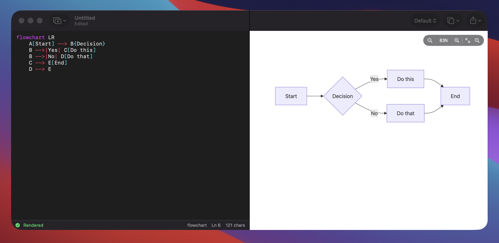

# MermaidMac

A native macOS [Mermaid](https://mermaid.js.org) diagram editor with a dual-pane
live editor + preview. Edit Mermaid syntax on the left, see the rendered diagram
on the right — instantly, fully offline.



## Features

- **Dual-pane editor** — split view with a draggable divider; code on the left,
  live preview on the right.
- **Live rendering** — the diagram re-renders as you type (configurable debounce),
  or on demand (⌘R) when auto-render is off.
- **Offline** — Mermaid 11 is bundled in the app; no network required.
- **Syntax highlighting** — keywords, arrows, strings, node shapes, comments and
  numbers are colored. Line numbers in the gutter.
- **12 diagram templates** — flowchart, sequence, class, state, ER, Gantt, pie,
  git graph, mindmap, user journey, timeline and quadrant. Insert from the toolbar.
- **Themes** — default, dark, forest, neutral, base.
- **Zoom & pan** — scroll to pan, ⌘-scroll to zoom, drag to pan, double-click to
  fit. Buttons for zoom in/out, actual size (⌘0) and fit-to-window (⌘9).
- **Background modes** — auto (follows theme), white, dark, transparent.
- **Export** — SVG, PNG (1×–4× scale), copy image to clipboard, copy SVG code.
- **Document-based** — opens and saves `.mmd` / `.mermaid` files with full
  undo, autosave and versions.
- **Error reporting** — Mermaid parse errors are surfaced inline without
  clobbering the last good render.

## Keyboard shortcuts

| Action            | Shortcut        |
|-------------------|-----------------|
| Render now        | ⌘R              |
| Zoom in / out     | ⌘+ / ⌘-         |
| Actual size       | ⌘0              |
| Fit to window     | ⌘9              |
| Export SVG        | ⇧⌘E             |
| Export PNG        | ⌥⌘E             |
| Find in editor    | ⌘F              |

## Building

Requires Xcode 16+ and [XcodeGen](https://github.com/yonsky/XcodeGen)
(`brew install xcodegen`).

```sh
xcodegen generate
xcodebuild -project MermaidMac.xcodeproj -scheme MermaidMac -configuration Debug build
```

Or open `MermaidMac.xcodeproj` in Xcode and hit Run.

## Project layout

```
Sources/
  MermaidMacApp.swift     App entry + DocumentGroup + Settings scene
  MermaidDocument.swift   FileDocument for .mmd / .mermaid
  ContentView.swift       Split view, toolbar, status bar, export
  CodeEditor.swift        NSTextView editor: highlighting + line numbers
  MermaidPreview.swift     WKWebView controller: render / zoom / export bridge
  Commands.swift          Menu bar commands + focused actions
  PreferencesView.swift   Settings UI
  AppSettings.swift       AppStorage-backed settings
  Templates.swift         Built-in diagram templates
  Resources/
    preview.html          Mermaid host page (render, zoom/pan, export)
    mermaid.min.js        Bundled Mermaid 11
```

## Updating Mermaid

```sh
curl -sL https://cdn.jsdelivr.net/npm/mermaid@11/dist/mermaid.min.js \
  -o Sources/Resources/mermaid.min.js
```
